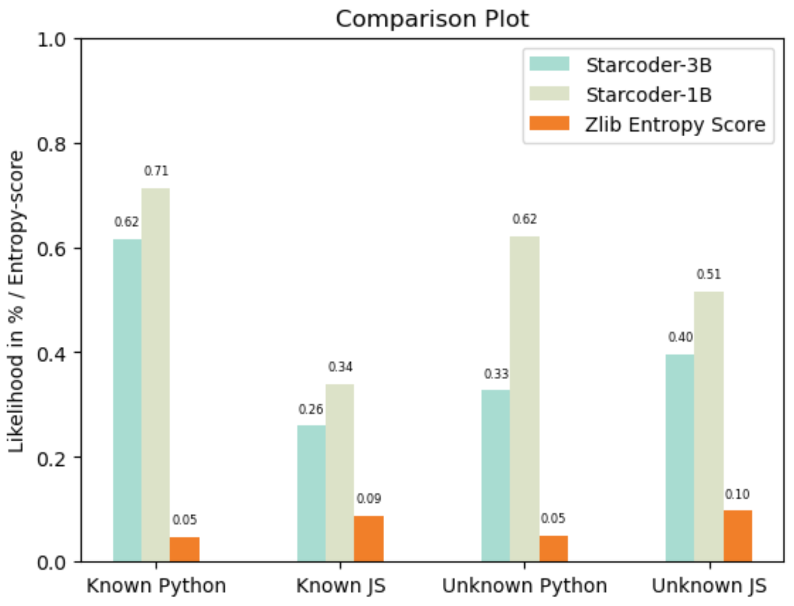

# Jetbrains-Coding-Challenge-Privacy-Preserving-Code-LLMs
This repository contains a solution for the Jetbrains coding challenge with the goal to investigate the likelihood with which LLMs trained on code reproduce data contained in their original training data.

## Results


Unfortunately, our results are inconclusive. Manually inspecting the likelihoods it seems like for the Python code our hypothesis, that the likelihood is higher for code from the training data, holds. Conversely, for the JavaScript code the opposite seems to be the case. It should be mentioned, however, that the entropy score for the known JavaScript code is a bit lower than for the unknown JavaScript. This hints at a higher inherent randomness in the known JavaScript code than in the unknown JavaScript code. The entropy for known and unknown python on the other hand appear very similar.

Further, we could not verify the claim that larger models are more prown to reproduce the training data [1]. While the difference between the likelihoods for known and unknown python code are larger for the model with 3B parameters than for the model with only 1B parameters (0.29 vs. 0.09) for some reason the likelihoods are in general higher for the 1B parameter model which limits the conclusions we can draw from this observation and requires further investigation.

In addition, the likelihoods we observed are pretty low overall. This could be due to the non-linear properties of the Softmax function, exaggarating the maximal value und suppressing the lower values. It could also indicate that we did not use the special tokens of these models correctly. In the best case, however, this indicates that it is not very likely to extract training data from the Code LLMs.

In summary, our preliminary results leave a lot of room for further investigation. While we did observe initial evidence that Code LLMs might reproduce the training data (here for the Python code) these findings are called into question by other examples (the JavaScript code).

## Installation and Getting Started
We recommend creating a new virtual environment for executing the notebook.

### Creating a virtual environment
Make sure you have Python installed and open a terminal. Navigate to the folder that contains the notebook e.g. by running
```
cd ./Jetbrains-Coding-Challenge-Privacy-Preserving-Code-LLMs
```

Then, run
```
python -m venv venv
```

This will create a new virtual environment. To activate the virtual environment run

MacOS/Linus:
```
source venv/bin/activate
```

Windows (Powershell):
```
venv/Scripts/Activate.ps1
```

Windows (Cmd):
```
venv/Scripts/activate
```

### Install dependencies
Use the provided requirements.txt to install all dependencies by running (with the virtual environment activated and while in the root directory of this repository)

```
pip install -r requirements.txt
```

### Accept license agreements
To be able to use the Starcoder models we have to accept the license agreements. Make sure you have a huggingface account or create one [here](https://huggingface.co/join).

Then, navigate to [this webpage](https://huggingface.co/bigcode/starcoderbase-1b), read the model license agreement, check the box next to **I accept the above license agreement, and will use the Model complying with the set of use restrictions and sharing requirements** and click on **Agree and access repository**.

Repeat the same steps for [this model page](https://huggingface.co/bigcode/starcoderbase-3b).

You will need your API access token from huggingface such that the huggingface API can verify that you accepted the agreements. For this purpose navigate [here](https://huggingface.co/settings/tokens) click **New token**, give it any name and select **read** as the Role. Then, click **generate a token**. It will now appear in the **User Access Tokens** list. Copy the token and continue.

### Set environment variable
We will save the access token in an environment variable. For this purpose open a terminal and activate the virtual environment. Then, run

Linux/MacOS:
```
export HUGGINGFACE_KEY=<your token>
```

Windows:
```
set HUGGINGFACE_KEY=<your token>
```

Then, start your jupyter notebook from this terminal.

As environment variables can be tricky to use sometimes you can alternatively add a new code cell to the jupyter notebook above all others and use this code:

```python
import os
os.environ["HUGGINGFACE_KEY"] = "<your token>"
```

After executing this code cell the environment variable will be set as well.